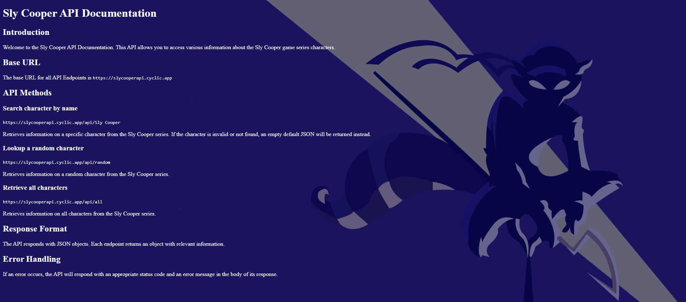

# SLY COOPER API: <a target="_blank" href="https://slyapi.onrender.com/">VISIT HERE</a>

The SlyCooper API is a powerful tool that allows developers to access and utilize data related to the popular video game franchise, Sly Cooper. 
This API provides a wide range of functionalities to retrieve information about characters. 
With the SlyCooper API, developers can build applications and websites that enhance and roleplay the Sly Cooper experience.

## How It's Made:

**Featured Tech:**
<picture></picture>
<picture></picture>
<picture></picture>
<picture></picture>
<picture></picture>
<picture></picture>

<b>This application has been updated from an express-node app that requires an active backend to a static front-end site using React-router and Supabase.</b>

I have deepened my appreciation for the convenience of react-router to make a static site with dynamic handling of routes and page navigation.

## Optimizations/Refactoring
When I improve the API design, I will implement API caching to boost performance with faster response times and reduced server load and costs.
Currently, the API only includes characters and lore from the first game in the series: "Sly Cooper and the Thievius Raccoonus". Plans are being made to incorporate the vast amount of others in the Sly Cooper Universe.

## Learned Lessons:

One of the biggest lessons I have learned throughout making the Sly Cooper API besides that I find it very nostalgic is that developing an API isn't nearly as challenging as I thought it would be so I may choose to do other franchises in the future.

Managing Row Level Security in the DB along with grabbing random records from tables via queries were some of the more unique challenges faced

After overhalling the API and overcoming some of the issues I had, I feel much more capable of resolving common bugs to create a product enjoyed by every Sly fan worldwide.

